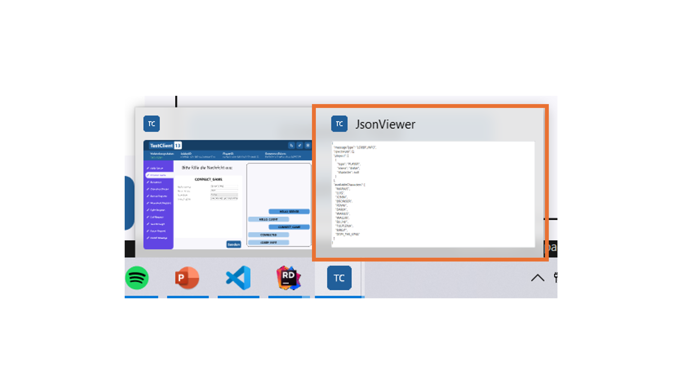

# GuiTestClient

Die TestClient-Anwendung bietet eine Möglichkeit den Nachrichtenaustausch mit dem Server zu testen. Dazu können über eine graphische Oberfläche Nachrichten erstellt und an den Server gesendet werden. Die JSON-Antworten des Servers werden dann auf in einem Chatverlauf dargestellt. 

Soll die Anwendung nur verwendet und nicht bearbeitet werden, so kann im Ordner `Releases` die neuste Version abgerufen werden. Im entsprechenden Ordner der Version ist dann die `.exe`-Datei als ausführbare Datei verfügbar. Durch Doppelklick auf die `.exe`-Datei kann die Anwendung gestartet werden. Normalerweise werden ausführbare Dateien nicht in git versioniert. Das Bereitstellen der `.exe`-Datei bietet jedoch eine schnelle Möglichkeit die Anwendung für Testzwecke zu verwenden, ohne das ganze Projekt öffnen zu müssen und ermöglicht es auch Team-Mitgliedern ohne VisualStudio-Installation die Anwendung zum Testen des Servers zu verwenden.

Soll die Anwendung bearbeitet oder verändert werden, so muss der Ordner `GuiTestClient` aufgerufen werden. Hier ist das VisualStudio-Projekt hinterlegt. Zur Erstellung der Anwendung wurde das WPF-Framework verwendet. VisualStudio bietet hier eine integrierte visuelle Darstellung der .xaml-Dateien und bietet sich daher als bevorzugte IDE an. 

## CliTestClient

 - Programmiersprache: C#
 - Bereitstellung: Source-Code und ausführbare .exe
 - Empfohlene IDE: Visual Studio

---

## Verwendung

### Host und Port auswählen

Nach dem Start der Anwendung wird ein kleines Fenster angezeigt, in dem Host und Port für die Verbindung zum Server konfiguriert werden können. Standardmäßig werden `Localhost` als Host und der Port `1992` verwendet. Nach dem Bestätigen per Klich auf `OK` versucht der TestClient eine Verbindung zum Server herzustellen. Dies kann einige Zeit in Anspruch nehmen und da kein Lade-Screen implementiert wurde, könnte der Eindruck entstehen das Programm sei abgestürzt. Anschließend öffnet sich der Haupt-Screen.

Wurde der Server zuvor nicht gestartet, so vermerkt der TestClient das Scheitern des Verbindungsaufbaus, indem unter `Verbindungsstatus` in roter Schrift `getrennt` angegeben wird. In diesem Fall kann nach dem Starten des Server durch das Klicken des `Reconnect`-Buttons eine Verbindung aufgebaut werden. Wurde der Server vor dem Start des Clients gestartet, so wird dies unter `Verbindungsstatus` in grüner Schrift mit `verbunden` vermerkt.

### Überblick

#### Verbindungsstatus

Dieses Feld gibt zu jeder Zeit an, ob der TestClient mit dem Server verbunden ist oder nicht. Da das Feld über ein Event aktualisiert wird, wird es im Fall eines Disconnects oder eines Reconnects aktualisiert.

#### Nachrichten senden

Im linken Bereich der Oberfläche befindet sich eine Leiste mit den Namen der möglichen Nachrichtentypen. Durch das Klicken auf einen Nachrichtentypen erscheinen in der Mitte der Oberfläche Eingabe- und Auswahlflächen. Für string-, int- und Guid-Werte werden TextBox-Elemente als freie Eingabeflächen verwendet, für Enum-Werte erfolgt die Eingabe durch ComboBox-Elemente, sodass nur aus einer begrenzten Anzahl Optionen ausgewählt werden kann. Der Nachrichtentyp wird für jede Nachricht als eigene TextBox angezeigt, die jedoch nicht bearbeitet werden kann.

Durch das Betätigen des `Senden`-Buttons wird die Nachricht an den Server gesendet. Die Nachricht erscheint dann auch im Nachrichtenverlauf auf der rechten Seite der Oberfläche. Ist eines der für die Nachrichten angegebenen Attribute nicht valide, so wird beim Betätigen des `Senden`-Buttons eine Fehlermeldung angezeigt und die Nachricht wird nicht gesendet.

#### Nachrichtenverlauf

In diesem Bereich der Oberfläche werden die vom Client gesendeten Nachrichten und die vom Server empfangenen Nachrichten in einem Art Chatverlauf dargestellt. Vom Client selbst gesendete Nachrichten werden auf der rechten Seite in einem dunklen Blauton dargestellt, vom Server empfangene Nachrichten werden in einem helleren Blauton auf der linken Seite angezeigt. Neue Nachrichten werden dabei unten an den Chatverlauf angeheftet - das bedeutet, dass die Nachricht ganz unten im Verlauf die neuste Nachricht ist. Durch das Klicken auf eine Nachricht im Nachrichtenverlauf öffnet sich ein neues Fenster, das den JSON-Inhalt der Nachricht anzeigt. 

Dabei kann es aufgrund eines Bugs vorkommen, dass das neu geöffnete Fenster nach dem Öffnen in den Hintergrund verschwindet. Das Fenster kann dann gemäß Betriebssystem wieder in den Vordergrund geöffnet werden (unter Windows durch Auswahl des Fensters in der Taskleiste).

#### IDs

Zur Erstellung bestimmter Nachrichtentypen (insbesondere Reconnect) müssen verschiedene Guids angegeben werden. Um diese IDs nicht aus den Nachrichten im Nachrichtenverlauf heraussuchen zu müssen gibt es eine Leiste, die die Guids anzeigt. Durch Klicken auf eines der Guid-Felder wird diese Guid in die Zwischenablage kopiert. Dies wird durch das Erscheinen eines Infofensters bestätigt. Nach dem Start der Anwendung sind die ID-Felder zunächst mit der Empty-Guid `00000000-0000-0000-0000-000000000000` belegt. Das belegen der Felder geschieht folgendermaßen: 

Die LobbyID wird aus vom Client gesendeten `CONNECT_GAME`-Nachrichten ausgelesen. Das heißt, dass diese Guid auch dann gesetzt wird, wenn der Connect nicht erfolgreich war (Server antwortet z.B. mit `ERROR` statt `CONNECTED`). Bei einem nachfolgenden erfolgreichen Connect mit einer neuen `CONNECT_GAME`-Nachricht wird das Feld dann mit der neuen Guid belegt. 

Die PlayerID und das ReconnectToken werden aus der `CONNECTED`-Nachricht des Servers ausgelesen.

#### Toolbar

Dieser Bereich der Oberfläche bietet drei Buttons. Jeder Button ist mit einem Tooltip versehen - bleibt man mit der Maus zwei Sekunden über dem Button, so wird die Funktion des Buttons angezeigt. Von rechts nach links sind die Buttons folgende: 

- `Beenden`: Durch Klicken dieses Buttons kann die TestClient-Anwendung beendet werden. 
- `Reconnect`: Durch Klicken dieses Buttons versucht der TestClient sich erneut mit dem Server zu verbinden, falls er im Moment vom Server disconnected ist. Ist dies nicht der Fall, so wird eine Fehlermeldung angezeigt. Dieser Button kann auch verwendet werden, um sich das erste Mal mit dem Server zu verbinden, falls dieser beim Start des TestClients noch nicht gestartet war.
- `Vom Server disconnecten`: Durch Klicken dieses Buttons versucht der TestClient seine Verbindung vom Server zu trennen, falls er im Moment mit dem Server verbundenn ist. Ist dies nicht der Fall, so wird eine Fehlermeldung angezeigt. 

#### Reconnect testen

Die im vorangegangen Abschnitt gezeigten Buttons können zum Testen der Reconnect-Funktionalität eingesetzt werden. Dazu kann während einer Verbindung mit dem Server der `Vom Server disconnecten`-Button gedrückt werden und anschließend der `Reconnect`-Button. Dann ist der Client neu mit dem Server verbunden. 

Soll nach einem Disconnect aus einer laufenden Partie mit einer `RECONNECT`-Nachricht in die Partie reconnected werden, so können die Guids in der [ID-Leiste](#ids) der Oberfläche zum Ausfüllen der `RECONNECT`-Nachricht per Klick kopiert werden. 

#### Fenster bewegen und Vollbild
 
Wird auf der oberen dunkelblauen Leiste die linke Maustaste gedrückt und gehalten, so kann das Fenster durch Bewegen der Maus verschoben werden.  

Durch Doppelklick auf diese obere dunkelblaue Leiste kann das Fenster maximiert oder in die ursprüngliche Fenstergröße zurück minimiert werden. Eine vollständige Minimierung des Fensters ist nicht möglich.

### Bemerkungen

Diese TestClient-Anwendung ist nicht als vollständig ausgereifte Anwendung konzipiert, sondern ist nur zum Testen von Server-Anwendungen gedacht.

## Releases

*v1.0:* Der TestClient ist darauf konfiguriert immer zu `Localhost` unter Port 3018 eine Verbindung aufzubauen. Dies beruhte auf einer alten Version des Standard-Dokuments.

*v1.1:* Nach dem Start der Anwendung wird nun ein Fenster gezeigt, in dem der Host und der Port zu dem sich der Client verbinden soll, ausgewählt werden können. Als Default-Werte werden dabei gemäß dem aktuellen Standard `Localhost` und der Port `1992` verwendet. 